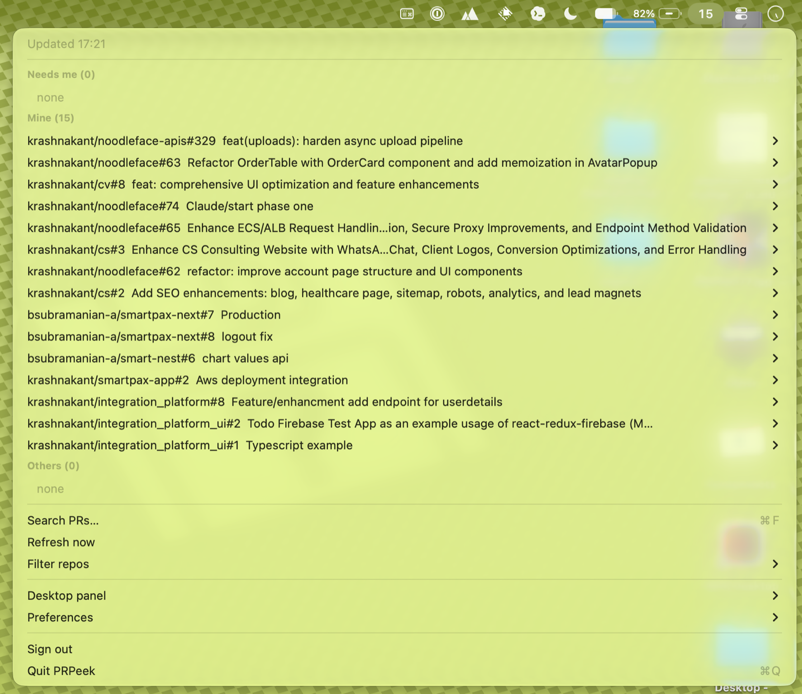
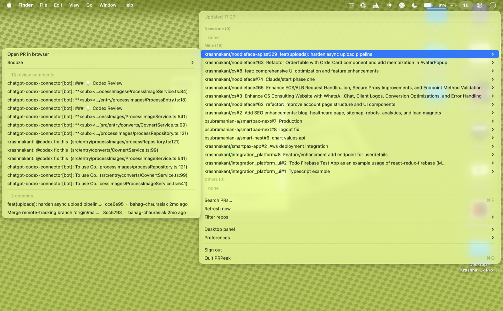
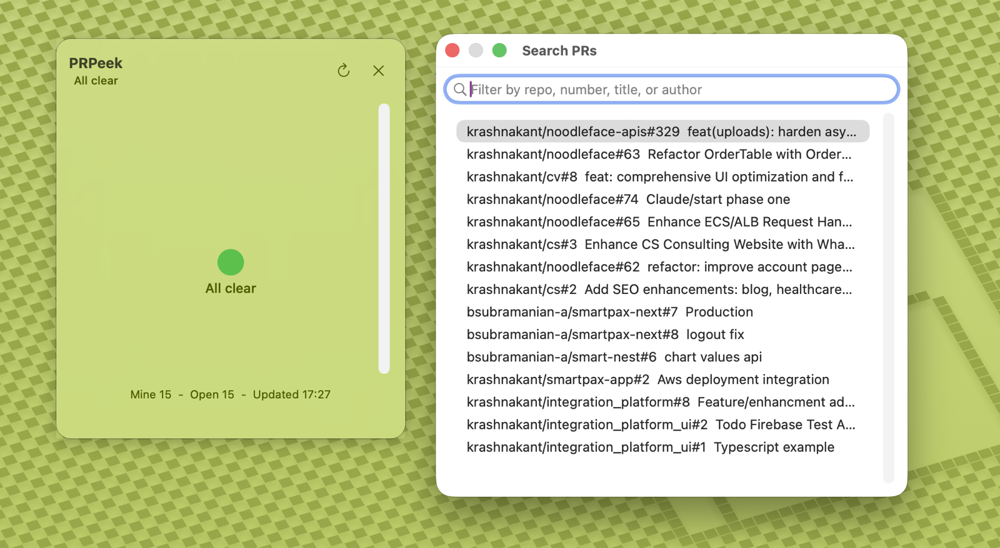

# PRPeek

A native macOS menubar app that watches your open GitHub pull requests — across
your personal repos **and** every org you're in — and tells you, at a glance,
which ones are **waiting on you**.

[](https://github.com/krashnakant/prpeek/actions/workflows/ci.yml)
[](https://github.com/krashnakant/prpeek/releases/latest)
[](https://github.com/krashnakant/prpeek/releases)
[](LICENSE)
&nbsp;macOS 26 (Tahoe)+ · Swift 6

**[Website](https://krashnakant.github.io/prpeek/)** &nbsp;·&nbsp; **[Download](https://github.com/krashnakant/prpeek/releases/latest)**

PRs scatter across tabs and orgs. PRPeek puts a single color-coded count in your
menu bar: red with a number when something needs your review or your CI is red,
calm when you're at inbox zero. No browser tab-hopping.

<p align="center">
  
</p>

<p align="center">
  
  &nbsp;
  
</p>

> Prior art, honestly: [Trailer](https://github.com/ptsochantaris/trailer) covers
> this category and is excellent. PRPeek is smaller and opinionated — it makes
> "waiting on me" the headline, not a setting.

## Features

- **Glanceable menubar badge** — a red pill with the count of PRs waiting on you;
  monochrome count when none; checkmark at inbox zero.
- **Three views** — `Needs me` (review requested of you, or your PR with failing
  CI), `Mine` (you authored), `Others` (involved but neither), plus a `Muted`
  section for snoozed PRs.
- **Precise "waiting on me"** — excludes drafts, honors live review requests
  (incl. team requests via your team memberships and CODEOWNERS), and your own
  PRs with a failed required/any check. The badge doesn't lie.
- **Shows *why*** — each "Needs me" row says the reason inline (review requested,
  team review, CI failing) and on hover, so the badge isn't just a binary signal.
- **Shows *how fresh*** — a second marker separates what you've dealt with from
  what you haven't: `new` (never opened), `stale` (waiting on you 3+ days), and
  `re-review` (you reviewed it, the author pushed and asked again). A PR you've
  opened and that's still recent stays unmarked, so only the untouched stand out.
  Opening a PR from any surface clears `new`; a push clears it again.
- **Snooze / mute** — hush a noisy PR for 1h, 4h, or until it next changes. Muted
  PRs drop out of the badge and notifications; a "hide until updated" snooze
  re-notifies once when the PR actually moves.
- **PR detail on expand** — each PR's submenu lists its commits (with per-commit
  CI) and review comments; hover any row for the full summary.
- **Search everything** — a keyboard-first window (⌘F) over *all* loaded PRs,
  filtered live by repo / number / title / author. ↑↓ to move, Enter to open.
- **Native notifications** — fires only on the transition (review requested, your
  CI fails), deduped, no storm on launch. Click → opens the PR.
- **Make it yours** — themes (System / Light / Dark / Catppuccin), a configurable
  refresh interval, an optional always-on-desktop panel, and launch-at-login.
- **Several accounts at once** — watch personal and work GitHub side by side in
  one badge and one list. Each account keeps its own token, ETag cache and
  identity, and each refreshes independently, so one rate-limited account never
  blanks the others. Rows carry an account tag once you have more than one.
- **Works with GitHub Enterprise** — add a GHES account by hostname; the rest is
  the same.
- **Two ways to sign in** — paste a PAT, or OAuth device flow (no client secret).
  Tokens stored in the Keychain, one entry per account.
- **Cheap polling** — GitHub Search (`involves:@me`, plus `team-review-requested`
  for CODEOWNERS team PRs) covers all repos with zero enumeration; ETag
  conditional requests make idle polls nearly free; a concurrency cap keeps the
  per-PR checks fan-out under the secondary rate limit.
- **Laptop-aware** — pauses on sleep, refreshes once on wake (no backlog burst),
  holds when offline and shows cached PRs, backs off when rate-limited.
- **Instant launch** — last PRs restored from an atomic JSON cache before the
  first poll returns.

## How it works

Logic lives in a fully-tested `PRPeekCore` library; the AppKit shell is thin.

```
 GitHub REST API
        ▲  │ ETag / 304 (idle polls ~free)
        │  ▼
 GitHubClient (actor) ──► SearchService  involves:@me + team-review-requested
   token in Keychain          │          (host configurable: github.com / GHES)
        ▲                     ▼
        │            RefreshEngine ──► per-PR enrich (detail + check-runs)
        │              (one coalesced     │  concurrency-capped
        │               pass)             ▼
        │                         Classifier → wait reason + CI rollup
        │                                 │
   JSONStore (atomic cache, ◄── persist ──┤
    incl. snooze state)                   ▼
                       @MainActor AppModel  ──►  NotificationPlanner (edge-fire,
                            │  (state + epoch guard + backoff)   muted-aware)
              ┌─────────────┼───────┬───────────────┐
              ▼             ▼       ▼               ▼
        menubar badge   dropdown  search window  macOS notifications
        (NSImage)       (sections)  (⌘F, all PRs)

 LifecycleMonitor: NSWorkspace sleep/wake + NWPathMonitor → drives the poll loop
```

Key design decisions (full record in `CONTRIBUTING.md` + the design doc):
- **Search backbone, not an org crawler.** `involves:@me` returns your PRs across
  everything the token sees — no per-repo/org enumeration.
- **Codable JSON file, not SwiftData.** Avoids the actor/`ModelContext` threading
  trap for a small dataset; schema-versioned with corrupt-file recovery.
- **Account-scoped correctness.** The ETag cache flushes on token change and an
  epoch guard discards in-flight refreshes after sign-out, so no data leaks across
  accounts.

## Install

**From a release:** download `PRPeek.dmg` from
[Releases](https://github.com/krashnakant/prpeek/releases), drag to Applications.

> [!IMPORTANT]
> The DMG is **ad-hoc signed, not notarized**, so macOS Gatekeeper blocks the
> **first launch** ("PRPeek is damaged / can't be opened"). Clear it once —
> either **right-click ▸ Open ▸ Open** in the dialog, or run:
> ```bash
> xattr -dr com.apple.quarantine /Applications/PRPeek.app
> ```

Notarization (Developer ID, friction-free install) needs a paid Apple Developer
account — skipped until download volume justifies it.

**From source:**
```bash
git clone https://github.com/krashnakant/prpeek.git
cd prpeek
bash Scripts/make-app.sh && open PRPeek.app
```

Requires macOS 26 (Tahoe)+ and Xcode 26+.

## Usage

Click the menubar icon → sign in:
- **Add account with token… (recommended)** — a name, a host, and a token. A
  read-only **fine-grained PAT** is the least-privilege option: Repository ▸ Pull
  requests **Read**, Contents **Read**, and Organization ▸ Members **Read** (for
  team-review/CODEOWNERS PRs). Watching is all that needs. To also **merge, ask
  for a re-review, or reply** from the menu, grant Pull requests **Write** — a
  read-only token simply won't offer those actions a path (GitHub refuses, PRPeek
  says so). A classic PAT works too but needs `repo` + `read:org`, which grants
  write wholesale. Works immediately. Leave the host blank for github.com, or
  enter your GHES hostname (e.g. `github.acme.com`).
- **Sign in with GitHub** — register an OAuth App (Settings ▸ Developer settings,
  enable Device Flow), then build with `PRPEEK_CLIENT_ID=<id>`. Device flow copies
  a code and opens the pre-filled GitHub page. github.com only — a GHES host needs
  its own OAuth App, so enterprise accounts use the token path above. Note:
  classic device flow has no read-only private-repo scope, so it requests
  write-capable `repo` — prefer a read-only fine-grained PAT if you want PRPeek
  to be able to watch but never write.

Add more accounts any time from **Accounts ▸ Add account…**; the same menu shows
each account's own status and signs individual accounts out.

The badge turns red with your "needs me" count; click any PR to open it. Expand
a PR for its commits + review comments.

**Day-to-day:**
- **Search PRs… (⌘F)** — find any PR across everything loaded; type to filter,
  ↑↓ to move, Enter to open.
- **Snooze** — in a PR's submenu, mute it for 1h / 4h / until it next updates.
  Unmute from the same place or the `Muted` section.
- **Merge** — in a PR's submenu: merge commit, squash, or rebase. Confirms
  first, and the merge is pinned to the head commit the menu was showing, so if
  someone pushed since your last refresh GitHub refuses instead of merging
  unreviewed work. Draft PRs don't get the option.
- **Request re-review** — on your own PRs, pick anyone who already reviewed.
  (GitHub un-requests a reviewer when they submit, so asking again *is* the
  re-review request.) The names come from the loaded review thread — open the
  PR's submenu once so it's there.
- **Reply to a review comment** — hold **⌥** over any comment row in a PR's
  submenu and it turns into *Reply to …*. Inline comments thread properly;
  replying to a review body posts a top-level PR comment instead (GitHub has no
  reply endpoint for reviews), and the dialog tells you which you're getting.
- **Accounts** (menu) — add or remove accounts and see each one's status. Repo
  filters are shared across accounts.
- **Settings** (menu) — `Theme`, `Refresh interval`, `Launch at login`,
  `Desktop panel`, and `Filter repos`.

## Security

PRPeek reads. The only exceptions are three actions you trigger by hand —
**merge**, **request re-review**, **reply to a comment** — which live in
`Sources/PRPeekCore/Writes.swift` and nowhere else; the refresh loop never
writes. It talks only to GitHub, holds one credential per account, and ships no
analytics or network telemetry. The app uses Apple's local unified logging
(`OSLog`) for diagnostic lifecycle/action events.

- **Token at rest** — stored in the macOS **Keychain** (generic password), never
  in the on-disk cache. The cache (`~/Library/Application Support/PRPeek/`) holds
  only PR metadata (titles, repo, author, CI state).
- **Least privilege** — a read-only fine-grained PAT (see [Usage](#usage)) is
  enough for everything PRPeek watches, and makes the three write actions
  impossible rather than merely unused. Grant Pull requests **Write** only if you
  want to merge/reply from the menu. Merging always asks for confirmation and is
  pinned to the head commit shown.
- **Transport** — HTTPS only to `api.github.com` / `github.com`, system TLS
  verification on (no cert pinning bypass). All hosts are hardcoded.
- **Account isolation** — the ETag cache flushes on token change and an epoch
  guard discards in-flight refreshes after sign-out; no data leaks across accounts.
- **No third-party dependencies** — zero SwiftPM deps, so no transitive CVE or
  install-script supply-chain surface.
- **Supply chain (CI/CD)** — all GitHub Actions are pinned to commit SHAs;
  `.github/CODEOWNERS` gates changes to workflows and build scripts. Releases run
  with `contents: write` only on tag push.

Distribution caveat: release DMGs are ad-hoc signed, **not notarized** — verify
you trust the source. Build from source if you prefer.

**Reporting:** found a vulnerability? Open a [private security advisory](https://github.com/krashnakant/prpeek/security/advisories/new)
rather than a public issue.

## Roadmap

- Approve / request changes from the menu (merge, re-review and replies
  already ship — see [Usage](#usage)) — v1.1
- Pinned-repo `[All]` coverage for repos you're not involved in — v1.1
- Notarized DMG (Developer ID) for friction-free install
- Auto-update (Sparkle), paired with the notarized DMG

## Contributing

See [CONTRIBUTING.md](CONTRIBUTING.md). `swift test` must stay green; CI runs it
on every PR.

## License

MIT — see [LICENSE](LICENSE).
